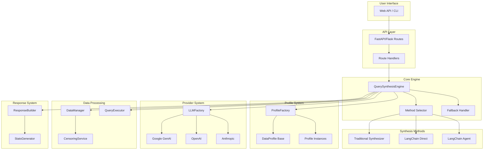
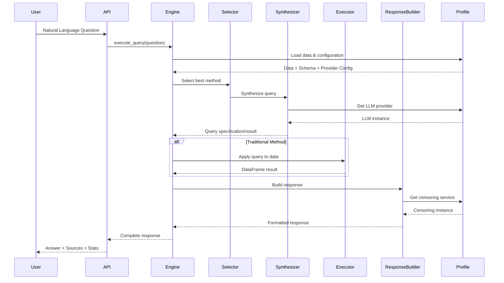
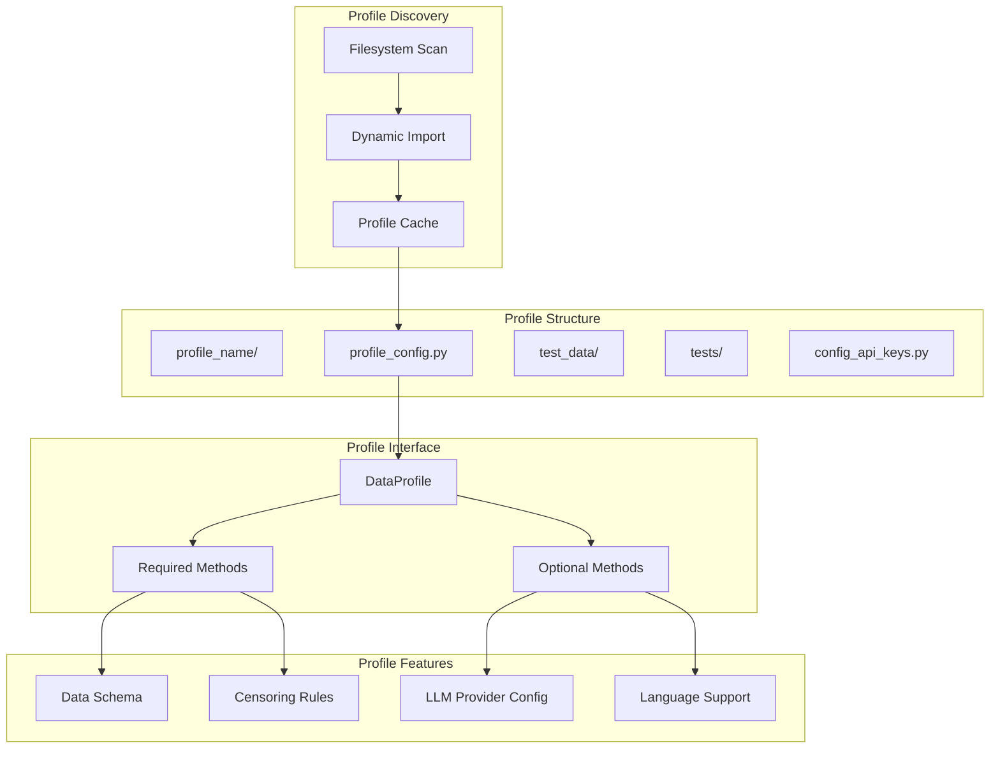
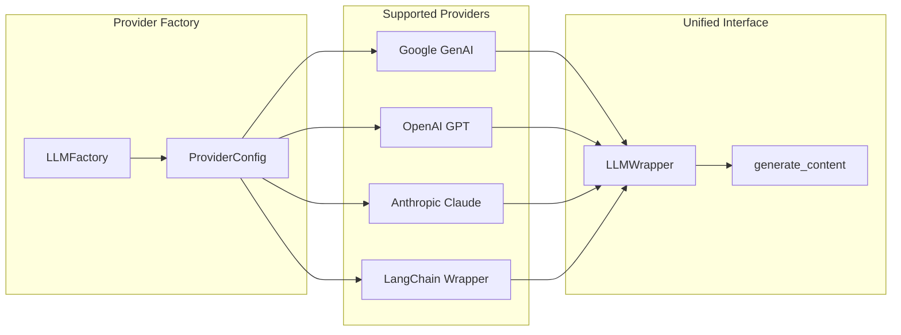

# Ultra Plus Text2Query - Profile-Agnostic Query Synthesis System

A sophisticated, profile-agnostic query synthesis system that converts natural language questions into structured data queries using multiple synthesis methods including traditional JSON-based synthesis and LangChain-powered approaches.

## 🏗️ Architecture Overview

The system is built with a modular, profile-agnostic architecture that allows seamless switching between different data profiles without code changes. The core design principles include:

- **Profile Independence**: Each profile is self-contained and can be added/removed without affecting the system
- **Provider Agnostic**: Supports multiple LLM providers (Google, OpenAI, Anthropic) through a unified interface
- **Multiple Synthesis Methods**: Intelligent selection between traditional, LangChain direct, and LangChain agent approaches
- **Comprehensive Testing**: Profile-agnostic test utilities that work with any data profile

## 📊 System Architecture



## 🔄 Query Processing Flow



## 🎯 Profile System Architecture



## 🔧 Provider System Architecture



## 📁 Directory Structure

```
ultra_plus_text2query/
├── config/
│   ├── settings.py                 # Global configuration
│   ├── profiles/
│   │   ├── profile_factory.py      # Dynamic profile discovery
│   │   ├── base_profile.py         # Abstract base class
│   │   ├── common_test_utils/      # Shared testing utilities
│   │   └── default_profile/        # Example profile
│   │       ├── profile_config.py   # Profile implementation
│   │       ├── test_data/          # Sample data
│   │       └── tests/              # Profile-specific tests
│   └── providers/
│       ├── registry.py             # LLM provider factory
│       └── langchain_provider.py   # LangChain integration
├── query_syn/
│   ├── engine.py                   # Main synthesis engine
│   ├── synthesis/                  # Query synthesis methods
│   ├── execution/                  # Query execution
│   ├── data/                       # Data management
│   └── response/                   # Response building
├── censor_utils/
│   ├── censoring.py                # Data censoring service
│   └── future_enhanced_censoring.py # Advanced censoring
├── api/
│   ├── app.py                      # Flask application
│   └── routes.py                   # API endpoints
└── logs/                           # Application logs
```

## 🚀 Key Features

### 1. Profile-Agnostic Design
- **Dynamic Profile Discovery**: Automatically discovers available profiles from filesystem
- **Zero Hardcoded Dependencies**: No profile-specific code outside profile folders
- **Seamless Switching**: Change active profile via single configuration setting
- **Independent Profiles**: Each profile can be added/removed without affecting others

### 2. Multi-Method Synthesis
- **Traditional JSON Synthesis**: Structured query specifications with validation
- **LangChain Direct**: Direct pandas code generation for complex queries
- **LangChain Agent**: Agent-based approach with tool usage and reasoning
- **Intelligent Selection**: Automatic method selection based on query complexity
- **Fallback Mechanisms**: Automatic fallback to alternative methods on failure

### 3. Provider Flexibility
- **Multi-Provider Support**: Google GenAI, OpenAI, Anthropic, and more
- **Unified Interface**: Consistent API across all providers
- **Profile-Specific Configuration**: Each profile can specify its preferred provider
- **LangChain Integration**: Seamless integration with LangChain ecosystem

### 4. Data Privacy & Security
- **Automatic Censoring**: Sensitive data is automatically censored in responses
- **Configurable Rules**: Each profile defines its own censoring rules
- **Reversible Censoring**: Original values can be retrieved when needed
- **Audit Trail**: Complete logging of all censoring operations

### 5. Comprehensive Testing
- **Profile-Agnostic Tests**: Shared test utilities work with any profile
- **Mock Providers**: Built-in mock LLM providers for testing
- **Data Generation**: Automatic test data generation based on profile schema
- **Integration Tests**: End-to-end testing of complete query flows

## 🔧 Configuration

The system uses a single configuration point in `config/settings.py`:

```python
PROFILE_NAME = "default_profile"  # Change this to switch profiles
```

All other configuration is handled within individual profiles, making the system truly modular and profile-agnostic.

## 📈 Performance & Monitoring

- **Performance Tracking**: Monitors success rates and execution times for each synthesis method
- **Intelligent Caching**: Caches profile discoveries and LLM provider instances
- **Comprehensive Logging**: Detailed logging of all operations for debugging and monitoring
- **Error Handling**: Graceful error handling with fallback mechanisms

## 🎯 Use Cases

1. **Data Analysis**: Convert natural language questions into structured data queries
2. **Business Intelligence**: Enable non-technical users to query complex datasets
3. **Customer Service**: Provide automated responses to data-related questions
4. **Research**: Accelerate data exploration and analysis workflows
5. **Education**: Teach data analysis through natural language interaction

## 🔄 Extensibility

The system is designed for easy extension:

- **New Profiles**: Add new data profiles by creating a new directory with required files
- **New Providers**: Add new LLM providers by implementing the LLMWrapper interface
- **New Synthesis Methods**: Add new synthesis approaches by extending the base classes
- **New Censoring Types**: Add new censoring rules by implementing the censoring interface

This architecture ensures the system remains maintainable, testable, and scalable as new requirements emerge.
