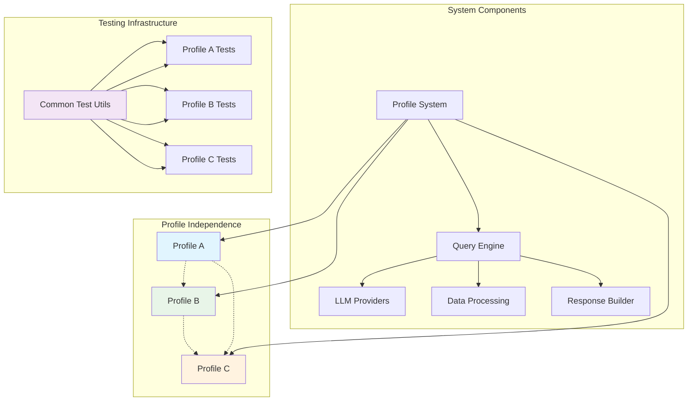
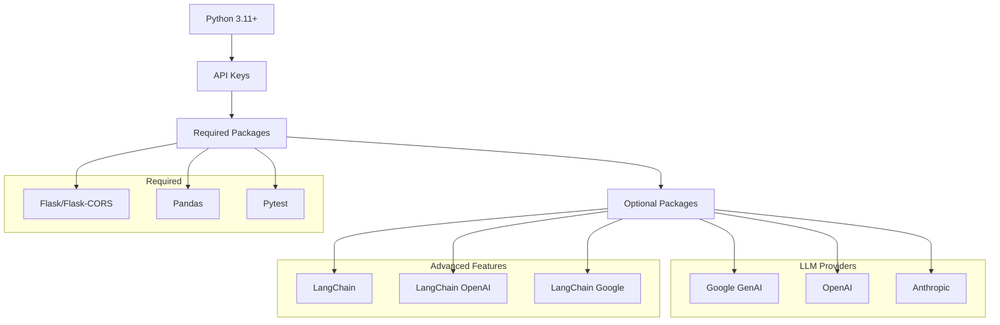
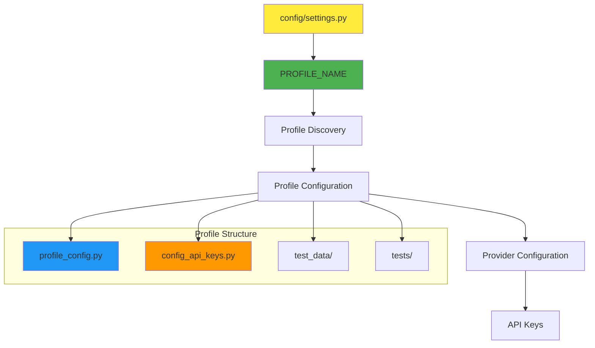
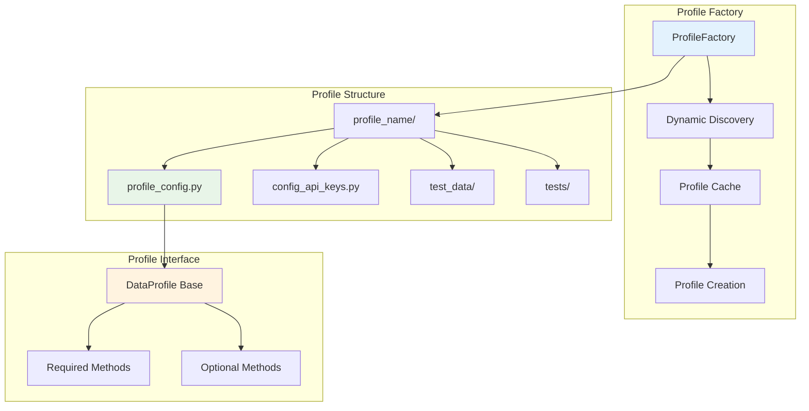
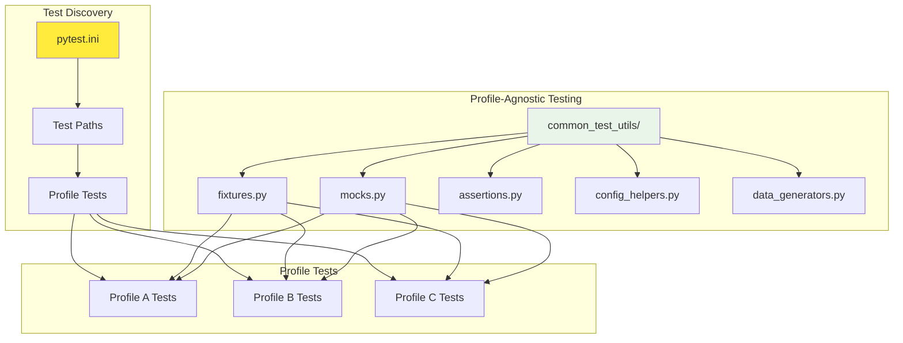
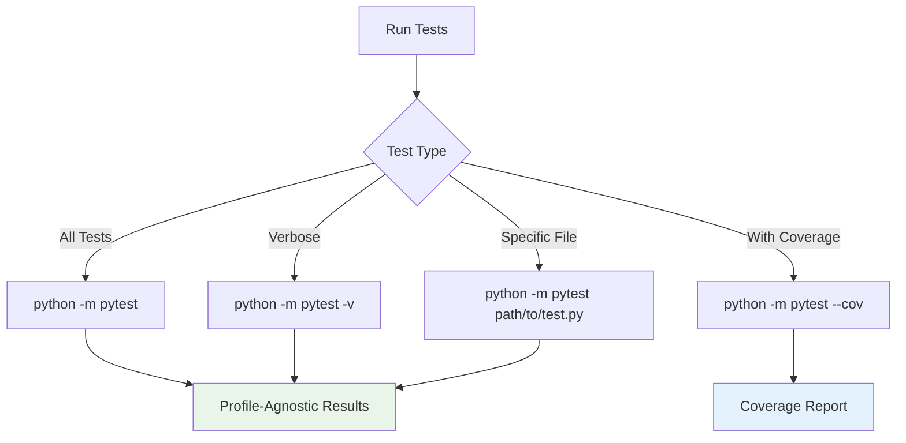
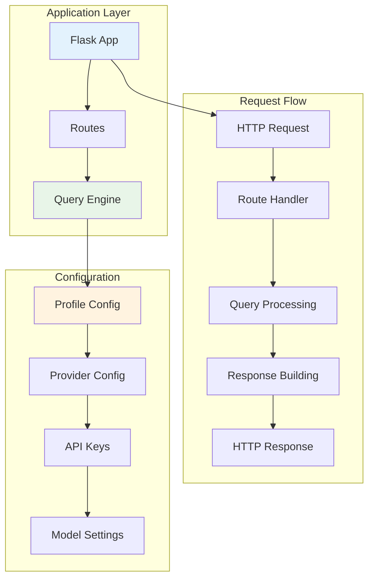
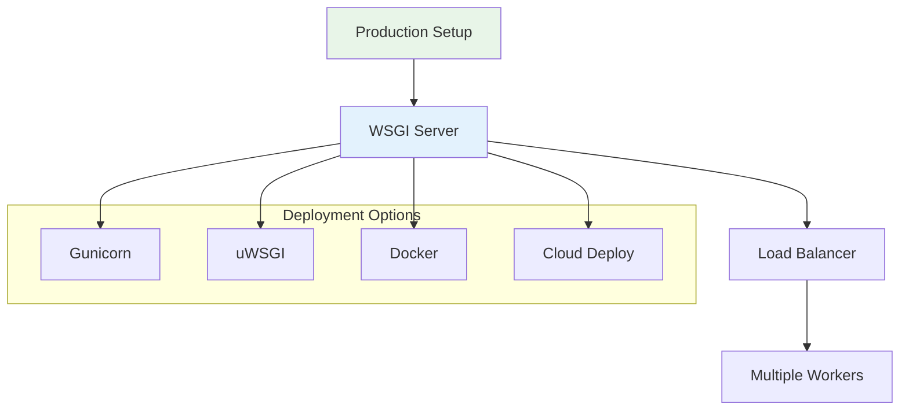
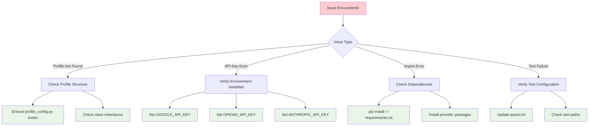

# Setup Guide - Ultra Plus Text2Query System

This comprehensive setup guide covers installation, configuration, testing, and server deployment with visual diagrams to make the process easy to follow.

## 📋 Table of Contents

1. [System Overview](#system-overview)
2. [Installation](#installation)
3. [Configuration](#configuration)
4. [Profile System Setup](#profile-system-setup)
5. [Testing Setup](#testing-setup)
6. [Server Setup](#server-setup)
7. [API Configuration](#api-configuration)
8. [Troubleshooting](#troubleshooting)

## 🎯 System Overview

The Ultra Plus Text2Query system is a profile-agnostic query synthesis platform that converts natural language questions into structured data queries. The system is designed with complete modularity - any profile can be added or removed without affecting the core system.



## 🚀 Installation

### Prerequisites



### Step-by-Step Installation

1. **Clone the Repository**
   ```bash
   git clone <repository-url>
   cd ultra_plus_text2query
   ```

2. **Create Virtual Environment**
   ```bash
   python -m venv venv
   source venv/bin/activate  # On Windows: venv\Scripts\activate
   ```

3. **Install Core Dependencies**
   ```bash
   pip install -r requirements.txt
   ```

4. **Install LLM Provider Packages (Choose your provider)**
   ```bash
   # For Google GenAI
   pip install google-genai
   
   # For OpenAI
   pip install openai
   
   # For Anthropic
   pip install anthropic
   
   # For LangChain features
   pip install langchain langchain-openai langchain-google-genai
   ```

## ⚙️ Configuration

### Configuration Architecture



### 1. Set Active Profile

Edit `config/settings.py`:
```python
PROFILE_NAME = "default_profile"  # Change this to switch profiles
```

### 2. Configure API Keys

Set environment variables for your chosen LLM provider:

```bash
# For Google GenAI
export GOOGLE_API_KEY="your-google-api-key-here"

# For OpenAI
export OPENAI_API_KEY="your-openai-api-key-here"

# For Anthropic
export ANTHROPIC_API_KEY="your-anthropic-api-key-here"
```

### 3. Verify Configuration

```bash
python -c "
from config.profiles.profile_factory import ProfileFactory
from config.settings import PROFILE_NAME

print(f'Active Profile: {PROFILE_NAME}')
print(f'Available Profiles: {ProfileFactory.get_available_profiles()}')

# Test profile loading
profile = ProfileFactory.get_default_profile()
print(f'Loaded Profile: {profile.profile_name}')
"
```

## 📁 Profile System Setup

### Profile Architecture



### Creating a New Profile

1. **Create Profile Directory**
   ```bash
   mkdir -p config/profiles/my_profile/{test_data,tests}
   ```

2. **Create Profile Configuration** (`config/profiles/my_profile/profile_config.py`)
   ```python
   from typing import Dict, Any, List, Callable
   from config.profiles.base_profile import DataProfile
   from config.providers.registry import ProviderConfig
   from censor_utils.censoring import CensoringService
   
   class MyProfileProfile(DataProfile):
       def __init__(self):
           super().__init__()
           self.profile_name = "my_profile"
           self.description = "My Custom Data Profile"
           self.data_file = "my_data.csv"
           self.censor_service = CensoringService()
       
       @property
       def required_columns(self) -> List[str]:
           return ['id', 'name', 'value', 'date']
       
       @property
       def text_columns(self) -> List[str]:
           return ['name']
       
       @property
       def date_columns(self) -> List[str]:
           return ['date']
       
       @property
       def numeric_columns(self) -> List[str]:
           return ['value']
       
       @property
       def sensitive_columns(self) -> Dict[str, str]:
           return {'name': 'text'}
       
       def get_csv_file_path(self) -> str:
           from pathlib import Path
           base_path = Path(__file__).parent
           return str(base_path / "test_data" / self.data_file)
       
       def get_provider_config(self) -> ProviderConfig:
           return ProviderConfig(
               provider="google",
               generation_model="gemini-1.5-flash",
               credentials={"api_key": "your-api-key-here"}
           )
       
       def get_censoring_service(self) -> CensoringService:
           return self.censor_service
       
       def get_censoring_mappings(self) -> Dict[str, Callable]:
           return {'text': self.censor_service.censor_text}
   ```

3. **Create API Key Configuration** (`config/profiles/my_profile/config_api_keys.py`)
   ```python
   import os
   
   def get_api_key() -> str:
       return os.getenv('GOOGLE_API_KEY', 'your-api-key-here')
   ```

4. **Add Test Data** (`config/profiles/my_profile/test_data/my_data.csv`)
   ```csv
   id,name,value,date
   1,John Doe,100,2024-01-01
   2,Jane Smith,200,2024-01-02
   3,Bob Johnson,150,2024-01-03
   ```

5. **Update Active Profile**
   ```python
   # In config/settings.py
   PROFILE_NAME = "my_profile"
   ```

## 🧪 Testing Setup

### Testing Architecture



### Test Configuration

Update `pytest.ini` to include your profile tests:
```ini
[tool:pytest]
testpaths = config/profiles/default_profile/tests
norecursedirs = *_backup
python_files = test_*.py *_test.py
python_classes = Test*
python_functions = test_*
```

### Running Tests



#### Test Commands

```bash
# Run all tests for current profile
python -m pytest

# Run with verbose output
python -m pytest -v

# Run specific test file
python -m pytest config/profiles/default_profile/tests/test_default_censoring.py -v

# Run tests with coverage
python -m pytest --cov=config --cov=query_syn --cov=censor_utils

# Run tests for specific profile (if multiple profiles exist)
PROFILE_NAME=my_profile python -m pytest config/profiles/my_profile/tests/ -v
```

### Profile-Agnostic Test Features

#### 1. Automatic Profile Detection
```python
from config.profiles.common_test_utils.fixtures import test_config

def test_with_current_profile(test_config):
    """Automatically uses the current active profile."""
    assert test_config.profile_name is not None
    print(f"Testing with profile: {test_config.profile_name}")
```

#### 2. Generic Data Generation
```python
from config.profiles.common_test_utils.config_helpers import create_profile_specific_test_data

def test_data_generation(tmp_path):
    """Generate test data matching the current profile's schema."""
    csv_path = create_profile_specific_test_data(PROFILE_NAME, tmp_path)
    # Data automatically matches the active profile's required columns
```

#### 3. Mock LLM Providers
```python
from config.profiles.common_test_utils.mocks import FakeLLMProvider

def test_with_mock_provider():
    """Test without making real API calls."""
    with FakeLLMProvider() as mock:
        # Your test code here
        result = mock.generate_content(["test prompt"])
        assert result is not None
```

## 🖥️ Server Setup

### Server Architecture



### Development Server

1. **Start Development Server**
   ```bash
   python api/app.py
   ```

2. **Verify Server is Running**
   ```bash
   curl http://localhost:9999/health
   ```

3. **Test API Endpoints**
   ```bash
   # Ask a question
   curl -X POST http://localhost:9999/ask \
     -H "Content-Type: application/json" \
     -d '{"question": "What is the average score?"}'
   
   # Get statistics
   curl http://localhost:9999/stats
   
   # Search
   curl -X POST http://localhost:9999/search \
     -H "Content-Type: application/json" \
     -d '{"query": "test"}'
   ```

### Production Server



#### Using Gunicorn

```bash
# Install Gunicorn
pip install gunicorn

# Run with multiple workers
gunicorn -w 4 -b 0.0.0.0:9999 api.app:app

# Run with configuration file
gunicorn -c gunicorn.conf.py api.app:app
```

#### Docker Deployment

Create `Dockerfile`:
```dockerfile
FROM python:3.11-slim

WORKDIR /app
COPY requirements.txt .
RUN pip install -r requirements.txt

COPY . .
EXPOSE 9999

CMD ["gunicorn", "-w", "4", "-b", "0.0.0.0:9999", "api.app:app"]
```

Build and run:
```bash
docker build -t ultra-plus-text2query .
docker run -p 9999:9999 -e GOOGLE_API_KEY=your-key ultra-plus-text2query
```

## 🌐 API Configuration

### API Endpoints

```mermaid
graph LR
    A[Client] --> B[/health]
    A --> C[/ask]
    A --> D[/stats]
    A --> E[/search]
    
    B --> F[Health Check]
    C --> G[Query Processing]
    D --> H[Data Statistics]
    E --> I[Data Search]
    
    style A fill:#e3f2fd
    style F fill:#e8f5e8
    style G fill:#fff3e0
    style H fill:#f3e5f5
    style I fill:#fce4ec
```

### Endpoint Details

#### Health Check
```bash
GET /health
Response: {"status": "healthy", "profile": "default_profile"}
```

#### Ask Question
```bash
POST /ask
Content-Type: application/json
{
  "question": "What is the average score across all records?"
}

Response: {
  "answer": "The average score is 8.5",
  "sources": [...],
  "stats": {...},
  "method": "traditional",
  "execution_time": 0.5
}
```

#### Get Statistics
```bash
GET /stats
Response: {
  "total_records": 1000,
  "dealers_count": 50,
  "message": "Query Synthesis API is running"
}
```

#### Search
```bash
POST /search
Content-Type: application/json
{
  "query": "dealer"
}

Response: {
  "results": [...],
  "total": 25
}
```

## 🔧 Troubleshooting

### Common Issues and Solutions



### Debugging Commands

```bash
# Check profile discovery
python -c "
from config.profiles.profile_factory import ProfileFactory
print('Available profiles:', ProfileFactory.get_available_profiles())
"

# Verify configuration
python -c "
from config.settings import PROFILE_NAME
print('Active profile:', PROFILE_NAME)
"

# Test profile loading
python -c "
from config.profiles.profile_factory import ProfileFactory
profile = ProfileFactory.get_default_profile()
print('Loaded profile:', profile.profile_name)
print('Data path:', profile.get_csv_file_path())
"

# Check API keys
python -c "
import os
print('Google API Key:', 'SET' if os.getenv('GOOGLE_API_KEY') else 'NOT SET')
print('OpenAI API Key:', 'SET' if os.getenv('OPENAI_API_KEY') else 'NOT SET')
print('Anthropic API Key:', 'SET' if os.getenv('ANTHROPIC_API_KEY') else 'NOT SET')
"
```

### Log Files

Check application logs in the `logs/` directory:
- `api_server.log` - Server operations
- `query_processing.log` - Query synthesis and execution
- `profile_loading.log` - Profile discovery and loading

### Performance Monitoring

```bash
# Check server health
curl http://localhost:9999/health

# Monitor API performance
curl -w "@curl-format.txt" -X POST http://localhost:9999/ask \
  -H "Content-Type: application/json" \
  -d '{"question": "test query"}'
```

## ✅ Verification Checklist

- [ ] Python 3.11+ installed
- [ ] Virtual environment created and activated
- [ ] Dependencies installed (`pip install -r requirements.txt`)
- [ ] LLM provider packages installed
- [ ] API keys configured in environment variables
- [ ] Profile configuration completed
- [ ] Test data added to profile
- [ ] Tests passing (`python -m pytest`)
- [ ] Server starting successfully (`python api/app.py`)
- [ ] API endpoints responding correctly
- [ ] Profile switching working

## 🎯 Next Steps

After successful setup:

1. **Explore the API**: Test different query types and methods
2. **Add Custom Profiles**: Create profiles for your specific data
3. **Extend Functionality**: Add new synthesis methods or providers
4. **Deploy to Production**: Set up monitoring and scaling
5. **Contribute**: Help improve the system with new features

The system is now ready for use! The profile-agnostic design ensures that you can easily add new data profiles and switch between them without any code changes to the core system.
